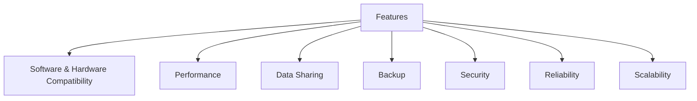
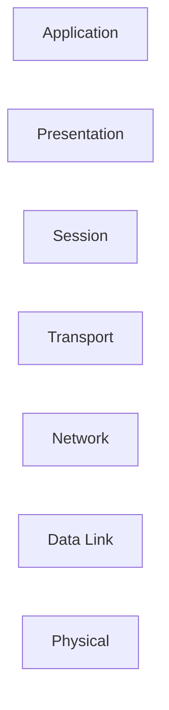

# 📡 What is Networking?
- Networking is the practice of connecting computers, servers, mainframes, and network devices to share data and resources.

# 💻 What is Computer Networking?
- Computer networking refers to interconnected computing devices that can exchange data and share resources with each other using transmission protocols.

## 🧾 Basic Terms in Computer Networking
1. **Node** – A device connected to the network (e.g., computer, printer, router).
2. **Protocol** – A set of rules and standards for data communication over networks (e.g., TCP/IP, HTTP).
3. **Topology** – The physical and logical arrangement of nodes in a network.
4. **Service Provider Network** – Networks owned by ISPs that provide internet and data services.
5. **IP Address** – A unique number identifying every device on a network.
6. **DNS** – Domain Name System translates domain names into IP addresses.
7. **Wired** – Uses cables like coaxial, twisted-pair, or optical fiber.
8. **Wireless** – Uses radio or electromagnetic signals for transmission.
9. **Network Access Control (NAC)** – Restricts unauthorized access to a network.
10. **Firewall** – Monitors and controls incoming/outgoing network traffic.
11. **Servers** – Devices managing storage, processing, and services on the network.

## 🔌 Network Devices
1. **Repeater**
2. **Hub**
3. **Switch**
4. **Router**
5. **Gateway**

## 🧩 Computer Network Features

## 🔁 Network Topologies

### Types:
1. **Point-to-Point** – One-to-one connection.
2. **Bus** – All devices share one communication line.
3. **Star** – All devices connect to a central hub.
4. **Mesh** – Devices are interconnected.
5. **Ring** – Each device connects to two others, forming a ring.
6. **Tree** – Hierarchical combination of star and bus.
7. **Hybrid** – Combines multiple topologies.

## 🌐 IP Addressing

### What is an IP Address?
- A unique address identifying a device on a network.

### Example:
- 192.158.1.38

### Versions:
1. **IPv4** – 32-bit address (~4.2 billion addresses)
   - Classes:
     - Class A – Large networks
     - Class B – Medium networks
     - Class C – Small networks
     - Class D – Multicast
     - Class E – Research
2. **IPv6** – 128-bit hexadecimal address format

### Classification:
- **Private IP Address**
- **Public IP Address**
  - *Dynamic IP* – Changes over time
  - *Static IP* – Fixed and assigned
- **Shared IP Address**
- **Dedicated IP Address**

## 🔄 Transmission Modes

1. **Simplex** – One-way (e.g., TV)
2. **Half-Duplex** – Two-way, but one direction at a time (e.g., walkie-talkie)
3. **Full-Duplex** – Two-way, simultaneous (e.g., phone)

## 🌍 Types of Computer Networks

1. **PAN (Personal Area Network)** – Very small range
2. **LAN (Local Area Network)** – Limited area like home or office
3. **MAN (Metropolitan Area Network)** – Covers city/town
4. **WAN (Wide Area Network)** – Covers country/globe

## 🧱 OSI Model – 7 Layers

1. **Application** – End-user interface
2. **Presentation** – Data format and encryption
3. **Session** – Connection establishment and control
4. **Transport** – Reliable delivery (TCP/UDP)
5. **Network** – Routing and addressing
6. **Data Link** – Error detection, MAC addressing
7. **Physical** – Physical transmission (cables, signals)

## 🌐 TCP/IP Model – 4 Layers
1. **Application Layer**
2. **Transport Layer**
3. **Internet Layer**
4. **Network Access Layer**

## 📡 Network Protocols

**Common Protocols:**
- **FTP** – File Transfer
- **HTTP/HTTPS** – Web communication
- **SMTP** – Email sending
- **IMAP/POP3** – Email receiving
- **TELNET** – Remote login
- **SSL/TLS** – Encryption & Security
- **TCP/IP** – Internet suite

### Protocol Categories:
1. **Communication Protocols**
2. **Management Protocols**
3. **Security Protocols**
